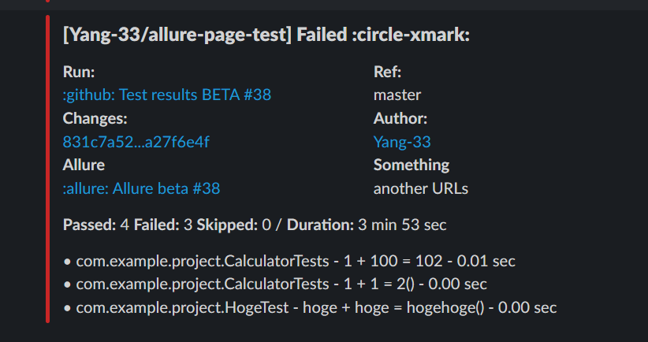

# allure-page-test

This repository demonstrates how to use GitHub Pages to display test results for different environments and settings (ALPHA, BETA, etc.) during CI testing. When using Allure to save test results, it is useful to distinguish between these environments.

## Structure

### Master Branch
- `/pages` - Top page of the gh-pages branch, requires manual maintenance.
- `/src` - Sample tests.

### GH-Pages Branch
- Results are separated into subdirectories, such as `/beta` and `/staging`.

#### samples
- top: https://yang-33.github.io/allure-page-test/
- sub(beta): https://yang-33.github.io/allure-page-test/bet
- sub(staging): https://yang-33.github.io/allure-page-test/staging

## Notifications
- Implemented notifications comparable to Jenkins.

